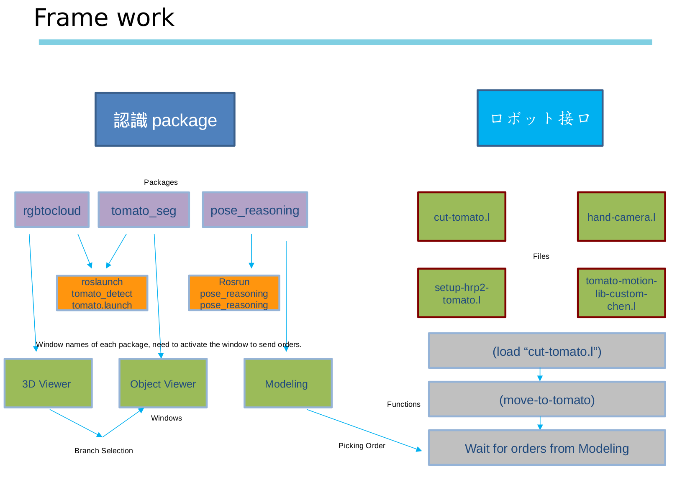

# denso_tomato

## tomato_process

### build

```
roscd
cd ..
catkin_make --force-cmake --only-pkg-with-deps rgbtocloud tomato_seg pose_reasoning

```

### run

```
roslaunch tomato_detect tomato.launch  //filter and segmentation
rosrun pose_reasoning pose_reasoning   // reasoning to get the pose
```

Hrp2w related:

rosrun roseus roseus

(load "cut-tomato.l")

### Operation
Please follow the process below, the performance cant be guaranteed due to the limitation of the algorithm and the calibration results.



## boundary_estimation

### build

```
catkin build boundary_estimation
```

### run

```
roslaunch boundary_estimation boundary_estimation.launch
```

